# Aviation-risk-analysis-for-new-ventures
This is a project that will give insights to investors both passive and active on the risks of venturing into aviation industry


#                       **PROJECT**
# AVIATION RISK ANALYSIS FOR NEW VENTURES


## PROJECT UNDERSTANDING
### Project Overview
This project analyzes data from aviation accident to give a concise, elaborate and  actionable safety recommendations for a company or venture capitalist looking to dive into the aviation industry. The main goal being to help an investor to determine the lower-risk aircrafts, aiding in strategic purchasing decisions.
The analysis will focus on generating actionable insights through data cleaning, visualization, and exploration. Its also worth noting that, this project can help the players in the aviation industry who are grabbling with losses due to many accidents by helpig them check if most of their aircrafts are of a high risk of crashing and endeavor to make a purchase shift. Similarly, it will also help other players who want to expand to understand the type of aircrafts that would be of benefits. To investors; the report will help them understand on which aviation companies they are mostly guaranteed of good returns by virtue of the types of aircarfts in their books. To the government; it will help when it comes to policy decision making in the aviation industry. e.g reducing crashes.

### Project Statement
The company intends to diversify its portfolio by investing in aviation, specifically focusing on commercial and private operations. The bottleneck of the initial stage being lack or little  knowledge about potential aircraft risks. This project therefore aims at analyzing data from aviation accidents to identify safer aircraft models and provide clear, concise and elaborate recommendations to stakeholders all driven by the data at hand.

### General Objective
The objective primarily being to generate insights that will guide decision-making for aircraft acquisition by assessing aviation accident risks across aircraft models, flight purposes, and accident phases, leveraging data analysis and visualization techniques to achieve our objective.

### Expected Outcomes
1. To clearly identify low-risk aircraft models for purchase.

2. To highlight or pin point flight purposes/phases associated with lower risks

3. To decipher patterns in aviation accidents, as well as the safety trends over time and across flight purposes and hence provide actioable steps for mitigating risks

### Metrics of Success
1. Delivering recommendations that is true and meaningful with decision-makers and general stateholders engagement in the aviation division.

2. Clarity of data ensuring analyses and visualizations are easy for a lay-man audience to understand.

3. Actionable insights that is geared towards recommendations that leads to informed and data-backed decisions about aircraft purchases.

4. Dashboard filters and visualizations provide clear, interactive exploration of key data.

5. Clean, reproducible code ensures accuracy and reliability of analysis in terms of technical quality

## DATA UNDERSTANDING
1. Import libraries
2. Load the dataset
3. Inspect the data-This will filter data to relevant columns and rows
4. Check for missing values- This will help in the process of data cleaning
5. Initial observations

### 1. Import libraries


```python
#lets start by importing necessary python libraries as they will assist with handling the data, analyzing and visualizing it
import pandas as pd
import numpy as np
import matplotlib.pyplot as plt
import seaborn as sns
```

### 2. Load the dataset


```python
#laoding data into a dataframe for ease of working with it from the csv file "AviationData.csv" using relative path
df = pd.read_csv('AviationData.csv', encoding='latin1', low_memory=False)
df.head(5) #displaying the first 5 rows of the dataframe to get a sense of the data structure and content
```


<div>
<style scoped>
    .dataframe tbody tr th:only-of-type {
        vertical-align: middle;
    }

    .dataframe tbody tr th {
        vertical-align: top;
    }

    .dataframe thead th {
        text-align: right;
    }
</style>
<table border="1" class="dataframe">
  <thead>
    <tr style="text-align: right;">
      <th></th>
      <th>Event.Id</th>
      <th>Investigation.Type</th>
      <th>Accident.Number</th>
      <th>Event.Date</th>
      <th>Location</th>
      <th>Country</th>
      <th>Latitude</th>
      <th>Longitude</th>
      <th>Airport.Code</th>
      <th>Airport.Name</th>
      <th>...</th>
      <th>Purpose.of.flight</th>
      <th>Air.carrier</th>
      <th>Total.Fatal.Injuries</th>
      <th>Total.Serious.Injuries</th>
      <th>Total.Minor.Injuries</th>
      <th>Total.Uninjured</th>
      <th>Weather.Condition</th>
      <th>Broad.phase.of.flight</th>
      <th>Report.Status</th>
      <th>Publication.Date</th>
    </tr>
  </thead>
  <tbody>
    <tr>
      <th>0</th>
      <td>20001218X45444</td>
      <td>Accident</td>
      <td>SEA87LA080</td>
      <td>1948-10-24</td>
      <td>MOOSE CREEK, ID</td>
      <td>United States</td>
      <td>NaN</td>
      <td>NaN</td>
      <td>NaN</td>
      <td>NaN</td>
      <td>...</td>
      <td>Personal</td>
      <td>NaN</td>
      <td>2.0</td>
      <td>0.0</td>
      <td>0.0</td>
      <td>0.0</td>
      <td>UNK</td>
      <td>Cruise</td>
      <td>Probable Cause</td>
      <td>NaN</td>
    </tr>
    <tr>
      <th>1</th>
      <td>20001218X45447</td>
      <td>Accident</td>
      <td>LAX94LA336</td>
      <td>1962-07-19</td>
      <td>BRIDGEPORT, CA</td>
      <td>United States</td>
      <td>NaN</td>
      <td>NaN</td>
      <td>NaN</td>
      <td>NaN</td>
      <td>...</td>
      <td>Personal</td>
      <td>NaN</td>
      <td>4.0</td>
      <td>0.0</td>
      <td>0.0</td>
      <td>0.0</td>
      <td>UNK</td>
      <td>Unknown</td>
      <td>Probable Cause</td>
      <td>19-09-1996</td>
    </tr>
    <tr>
      <th>2</th>
      <td>20061025X01555</td>
      <td>Accident</td>
      <td>NYC07LA005</td>
      <td>1974-08-30</td>
      <td>Saltville, VA</td>
      <td>United States</td>
      <td>36.922223</td>
      <td>-81.878056</td>
      <td>NaN</td>
      <td>NaN</td>
      <td>...</td>
      <td>Personal</td>
      <td>NaN</td>
      <td>3.0</td>
      <td>NaN</td>
      <td>NaN</td>
      <td>NaN</td>
      <td>IMC</td>
      <td>Cruise</td>
      <td>Probable Cause</td>
      <td>26-02-2007</td>
    </tr>
    <tr>
      <th>3</th>
      <td>20001218X45448</td>
      <td>Accident</td>
      <td>LAX96LA321</td>
      <td>1977-06-19</td>
      <td>EUREKA, CA</td>
      <td>United States</td>
      <td>NaN</td>
      <td>NaN</td>
      <td>NaN</td>
      <td>NaN</td>
      <td>...</td>
      <td>Personal</td>
      <td>NaN</td>
      <td>2.0</td>
      <td>0.0</td>
      <td>0.0</td>
      <td>0.0</td>
      <td>IMC</td>
      <td>Cruise</td>
      <td>Probable Cause</td>
      <td>12-09-2000</td>
    </tr>
    <tr>
      <th>4</th>
      <td>20041105X01764</td>
      <td>Accident</td>
      <td>CHI79FA064</td>
      <td>1979-08-02</td>
      <td>Canton, OH</td>
      <td>United States</td>
      <td>NaN</td>
      <td>NaN</td>
      <td>NaN</td>
      <td>NaN</td>
      <td>...</td>
      <td>Personal</td>
      <td>NaN</td>
      <td>1.0</td>
      <td>2.0</td>
      <td>NaN</td>
      <td>0.0</td>
      <td>VMC</td>
      <td>Approach</td>
      <td>Probable Cause</td>
      <td>16-04-1980</td>
    </tr>
  </tbody>
</table>
<p>5 rows × 31 columns</p>
</div>


### 3. Inspect the data


```python
#get an overview of the data types and non-null values in each column
df.info() #this will show the data types and non-null counts for each column in the dataframe
```

    <class 'pandas.core.frame.DataFrame'>
    RangeIndex: 88889 entries, 0 to 88888
    Data columns (total 31 columns):
     #   Column                  Non-Null Count  Dtype  
    ---  ------                  --------------  -----  
     0   Event.Id                88889 non-null  object 
     1   Investigation.Type      88889 non-null  object 
     2   Accident.Number         88889 non-null  object 
     3   Event.Date              88889 non-null  object 
     4   Location                88837 non-null  object 
     5   Country                 88663 non-null  object 
     6   Latitude                34382 non-null  object 
     7   Longitude               34373 non-null  object 
     8   Airport.Code            50249 non-null  object 
     9   Airport.Name            52790 non-null  object 
     10  Injury.Severity         87889 non-null  object 
     11  Aircraft.damage         85695 non-null  object 
     12  Aircraft.Category       32287 non-null  object 
     13  Registration.Number     87572 non-null  object 
     14  Make                    88826 non-null  object 
     15  Model                   88797 non-null  object 
     16  Amateur.Built           88787 non-null  object 
     17  Number.of.Engines       82805 non-null  float64
     18  Engine.Type             81812 non-null  object 
     19  FAR.Description         32023 non-null  object 
     20  Schedule                12582 non-null  object 
     21  Purpose.of.flight       82697 non-null  object 
     22  Air.carrier             16648 non-null  object 
     23  Total.Fatal.Injuries    77488 non-null  float64
     24  Total.Serious.Injuries  76379 non-null  float64
     25  Total.Minor.Injuries    76956 non-null  float64
     26  Total.Uninjured         82977 non-null  float64
     27  Weather.Condition       84397 non-null  object 
     28  Broad.phase.of.flight   61724 non-null  object 
     29  Report.Status           82508 non-null  object 
     30  Publication.Date        75118 non-null  object 
    dtypes: float64(5), object(26)
    memory usage: 21.0+ MB
    


```python
df.describe() #this will provide a summary of the numerical columns in the dataframe, including count, mean, std, min, 25%, 50%, 75%, and max values
```


<div>
<style scoped>
    .dataframe tbody tr th:only-of-type {
        vertical-align: middle;
    }

    .dataframe tbody tr th {
        vertical-align: top;
    }

    .dataframe thead th {
        text-align: right;
    }
</style>
<table border="1" class="dataframe">
  <thead>
    <tr style="text-align: right;">
      <th></th>
      <th>Number.of.Engines</th>
      <th>Total.Fatal.Injuries</th>
      <th>Total.Serious.Injuries</th>
      <th>Total.Minor.Injuries</th>
      <th>Total.Uninjured</th>
    </tr>
  </thead>
  <tbody>
    <tr>
      <th>count</th>
      <td>82805.000000</td>
      <td>77488.000000</td>
      <td>76379.000000</td>
      <td>76956.000000</td>
      <td>82977.000000</td>
    </tr>
    <tr>
      <th>mean</th>
      <td>1.146585</td>
      <td>0.647855</td>
      <td>0.279881</td>
      <td>0.357061</td>
      <td>5.325440</td>
    </tr>
    <tr>
      <th>std</th>
      <td>0.446510</td>
      <td>5.485960</td>
      <td>1.544084</td>
      <td>2.235625</td>
      <td>27.913634</td>
    </tr>
    <tr>
      <th>min</th>
      <td>0.000000</td>
      <td>0.000000</td>
      <td>0.000000</td>
      <td>0.000000</td>
      <td>0.000000</td>
    </tr>
    <tr>
      <th>25%</th>
      <td>1.000000</td>
      <td>0.000000</td>
      <td>0.000000</td>
      <td>0.000000</td>
      <td>0.000000</td>
    </tr>
    <tr>
      <th>50%</th>
      <td>1.000000</td>
      <td>0.000000</td>
      <td>0.000000</td>
      <td>0.000000</td>
      <td>1.000000</td>
    </tr>
    <tr>
      <th>75%</th>
      <td>1.000000</td>
      <td>0.000000</td>
      <td>0.000000</td>
      <td>0.000000</td>
      <td>2.000000</td>
    </tr>
    <tr>
      <th>max</th>
      <td>8.000000</td>
      <td>349.000000</td>
      <td>161.000000</td>
      <td>380.000000</td>
      <td>699.000000</td>
    </tr>
  </tbody>
</table>
</div>


### 4. checking for missing values  


```python
print(df.isnull().sum()) #this will show the number of missing values in each column of the dataframe
#checking for duplicates in the dataframe
print(df.duplicated("Event.Id").sum()) #this will return the number of duplicate rows in the dataframe
```

    Event.Id                      0
    Investigation.Type            0
    Accident.Number               0
    Event.Date                    0
    Location                     52
    Country                     226
    Latitude                  54507
    Longitude                 54516
    Airport.Code              38640
    Airport.Name              36099
    Injury.Severity            1000
    Aircraft.damage            3194
    Aircraft.Category         56602
    Registration.Number        1317
    Make                         63
    Model                        92
    Amateur.Built               102
    Number.of.Engines          6084
    Engine.Type                7077
    FAR.Description           56866
    Schedule                  76307
    Purpose.of.flight          6192
    Air.carrier               72241
    Total.Fatal.Injuries      11401
    Total.Serious.Injuries    12510
    Total.Minor.Injuries      11933
    Total.Uninjured            5912
    Weather.Condition          4492
    Broad.phase.of.flight     27165
    Report.Status              6381
    Publication.Date          13771
    dtype: int64
    938
    

### 5. Initial observations
#### 1. Dataset size
- The data contains 88,889 rows and 31 columns
#### 2. Key columns
**Event.Date**: To analyze trends over time, such as accident frequency by year.

**Aircraft.Category**: To group and compare aircraft types.

**Make**: Helps identify specific manufacturers and their safety records.

**Model**: Provides granular insights into different aircraft models.

**Purpose.of.flight**: Critical for understanding the context of the flight (e.g., commercial, private, instructional).

**Injury.Severity**: Key indicator for evaluating safety (e.g., fatal, serious, minor).

**Broad.phase.of.flight**: Highlights which flight phases are riskier (e.g., takeoff, landing).

**Total.Fatal.Injuries, Total.Serious.Injuries, Total.Minor.Injuries, Total.Uninjured**: Quantifies the outcomes of accidents.

**Weather.Condition**: Examines the impact of weather on accidents.

**Number.of.Engines**: Could provide insights into whether single-engine or multi-engine aircraft have better safety records.

**Engine.Type**: Links engine design to safety metrics.

## DATA CLEANING
This will help with missing data cleaning, any duplications and outliers in our dataset


```python
#filtering the dataframe to include only relevant columns for analysis
#this will help in reducing the complexity of the data and focusing on the columns that are most relevant to the analysis
relevant_columns = [
    "Event.Date",
    "Aircraft.Category",
    "Make",
    "Model",
    "Purpose.of.flight",
    "Injury.Severity",
    "Broad.phase.of.flight",
    "Total.Fatal.Injuries",
    "Total.Serious.Injuries",
    "Total.Minor.Injuries",
    "Total.Uninjured",
    "Weather.Condition",
    "Number.of.Engines",
    "Engine.Type",
]
```


```python
#this will filter the dataframe to include only the relevant columns specified in the list above
df = df[relevant_columns].copy() #using .copy() to create a new dataframe to avoid SettingWithCopyWarning in pandas
df
```


<div>
<style scoped>
    .dataframe tbody tr th:only-of-type {
        vertical-align: middle;
    }

    .dataframe tbody tr th {
        vertical-align: top;
    }

    .dataframe thead th {
        text-align: right;
    }
</style>
<table border="1" class="dataframe">
  <thead>
    <tr style="text-align: right;">
      <th></th>
      <th>Event.Date</th>
      <th>Aircraft.Category</th>
      <th>Make</th>
      <th>Model</th>
      <th>Purpose.of.flight</th>
      <th>Injury.Severity</th>
      <th>Broad.phase.of.flight</th>
      <th>Total.Fatal.Injuries</th>
      <th>Total.Serious.Injuries</th>
      <th>Total.Minor.Injuries</th>
      <th>Total.Uninjured</th>
      <th>Weather.Condition</th>
      <th>Number.of.Engines</th>
      <th>Engine.Type</th>
    </tr>
  </thead>
  <tbody>
    <tr>
      <th>0</th>
      <td>1948-10-24</td>
      <td>NaN</td>
      <td>Stinson</td>
      <td>108-3</td>
      <td>Personal</td>
      <td>Fatal(2)</td>
      <td>Cruise</td>
      <td>2.0</td>
      <td>0.0</td>
      <td>0.0</td>
      <td>0.0</td>
      <td>UNK</td>
      <td>1.0</td>
      <td>Reciprocating</td>
    </tr>
    <tr>
      <th>1</th>
      <td>1962-07-19</td>
      <td>NaN</td>
      <td>Piper</td>
      <td>PA24-180</td>
      <td>Personal</td>
      <td>Fatal(4)</td>
      <td>Unknown</td>
      <td>4.0</td>
      <td>0.0</td>
      <td>0.0</td>
      <td>0.0</td>
      <td>UNK</td>
      <td>1.0</td>
      <td>Reciprocating</td>
    </tr>
    <tr>
      <th>2</th>
      <td>1974-08-30</td>
      <td>NaN</td>
      <td>Cessna</td>
      <td>172M</td>
      <td>Personal</td>
      <td>Fatal(3)</td>
      <td>Cruise</td>
      <td>3.0</td>
      <td>NaN</td>
      <td>NaN</td>
      <td>NaN</td>
      <td>IMC</td>
      <td>1.0</td>
      <td>Reciprocating</td>
    </tr>
    <tr>
      <th>3</th>
      <td>1977-06-19</td>
      <td>NaN</td>
      <td>Rockwell</td>
      <td>112</td>
      <td>Personal</td>
      <td>Fatal(2)</td>
      <td>Cruise</td>
      <td>2.0</td>
      <td>0.0</td>
      <td>0.0</td>
      <td>0.0</td>
      <td>IMC</td>
      <td>1.0</td>
      <td>Reciprocating</td>
    </tr>
    <tr>
      <th>4</th>
      <td>1979-08-02</td>
      <td>NaN</td>
      <td>Cessna</td>
      <td>501</td>
      <td>Personal</td>
      <td>Fatal(1)</td>
      <td>Approach</td>
      <td>1.0</td>
      <td>2.0</td>
      <td>NaN</td>
      <td>0.0</td>
      <td>VMC</td>
      <td>NaN</td>
      <td>NaN</td>
    </tr>
    <tr>
      <th>...</th>
      <td>...</td>
      <td>...</td>
      <td>...</td>
      <td>...</td>
      <td>...</td>
      <td>...</td>
      <td>...</td>
      <td>...</td>
      <td>...</td>
      <td>...</td>
      <td>...</td>
      <td>...</td>
      <td>...</td>
      <td>...</td>
    </tr>
    <tr>
      <th>88884</th>
      <td>2022-12-26</td>
      <td>NaN</td>
      <td>PIPER</td>
      <td>PA-28-151</td>
      <td>Personal</td>
      <td>Minor</td>
      <td>NaN</td>
      <td>0.0</td>
      <td>1.0</td>
      <td>0.0</td>
      <td>0.0</td>
      <td>NaN</td>
      <td>NaN</td>
      <td>NaN</td>
    </tr>
    <tr>
      <th>88885</th>
      <td>2022-12-26</td>
      <td>NaN</td>
      <td>BELLANCA</td>
      <td>7ECA</td>
      <td>NaN</td>
      <td>NaN</td>
      <td>NaN</td>
      <td>0.0</td>
      <td>0.0</td>
      <td>0.0</td>
      <td>0.0</td>
      <td>NaN</td>
      <td>NaN</td>
      <td>NaN</td>
    </tr>
    <tr>
      <th>88886</th>
      <td>2022-12-26</td>
      <td>Airplane</td>
      <td>AMERICAN CHAMPION AIRCRAFT</td>
      <td>8GCBC</td>
      <td>Personal</td>
      <td>Non-Fatal</td>
      <td>NaN</td>
      <td>0.0</td>
      <td>0.0</td>
      <td>0.0</td>
      <td>1.0</td>
      <td>VMC</td>
      <td>1.0</td>
      <td>NaN</td>
    </tr>
    <tr>
      <th>88887</th>
      <td>2022-12-26</td>
      <td>NaN</td>
      <td>CESSNA</td>
      <td>210N</td>
      <td>Personal</td>
      <td>NaN</td>
      <td>NaN</td>
      <td>0.0</td>
      <td>0.0</td>
      <td>0.0</td>
      <td>0.0</td>
      <td>NaN</td>
      <td>NaN</td>
      <td>NaN</td>
    </tr>
    <tr>
      <th>88888</th>
      <td>2022-12-29</td>
      <td>NaN</td>
      <td>PIPER</td>
      <td>PA-24-260</td>
      <td>Personal</td>
      <td>Minor</td>
      <td>NaN</td>
      <td>0.0</td>
      <td>1.0</td>
      <td>0.0</td>
      <td>1.0</td>
      <td>NaN</td>
      <td>NaN</td>
      <td>NaN</td>
    </tr>
  </tbody>
</table>
<p>88889 rows × 14 columns</p>
</div>


```python
df.describe() #this will provide a summary of the numerical columns in the dataframe, including count, mean, std, min, 25%, 50%, 75%, and max values
```


<div>
<style scoped>
    .dataframe tbody tr th:only-of-type {
        vertical-align: middle;
    }

    .dataframe tbody tr th {
        vertical-align: top;
    }

    .dataframe thead th {
        text-align: right;
    }
</style>
<table border="1" class="dataframe">
  <thead>
    <tr style="text-align: right;">
      <th></th>
      <th>Total.Fatal.Injuries</th>
      <th>Total.Serious.Injuries</th>
      <th>Total.Minor.Injuries</th>
      <th>Total.Uninjured</th>
      <th>Number.of.Engines</th>
    </tr>
  </thead>
  <tbody>
    <tr>
      <th>count</th>
      <td>77488.000000</td>
      <td>76379.000000</td>
      <td>76956.000000</td>
      <td>82977.000000</td>
      <td>82805.000000</td>
    </tr>
    <tr>
      <th>mean</th>
      <td>0.647855</td>
      <td>0.279881</td>
      <td>0.357061</td>
      <td>5.325440</td>
      <td>1.146585</td>
    </tr>
    <tr>
      <th>std</th>
      <td>5.485960</td>
      <td>1.544084</td>
      <td>2.235625</td>
      <td>27.913634</td>
      <td>0.446510</td>
    </tr>
    <tr>
      <th>min</th>
      <td>0.000000</td>
      <td>0.000000</td>
      <td>0.000000</td>
      <td>0.000000</td>
      <td>0.000000</td>
    </tr>
    <tr>
      <th>25%</th>
      <td>0.000000</td>
      <td>0.000000</td>
      <td>0.000000</td>
      <td>0.000000</td>
      <td>1.000000</td>
    </tr>
    <tr>
      <th>50%</th>
      <td>0.000000</td>
      <td>0.000000</td>
      <td>0.000000</td>
      <td>1.000000</td>
      <td>1.000000</td>
    </tr>
    <tr>
      <th>75%</th>
      <td>0.000000</td>
      <td>0.000000</td>
      <td>0.000000</td>
      <td>2.000000</td>
      <td>1.000000</td>
    </tr>
    <tr>
      <th>max</th>
      <td>349.000000</td>
      <td>161.000000</td>
      <td>380.000000</td>
      <td>699.000000</td>
      <td>8.000000</td>
    </tr>
  </tbody>
</table>
</div>


```python
df.info() #this will show the data types and non-null counts for each column in the dataframe
```

    <class 'pandas.core.frame.DataFrame'>
    RangeIndex: 88889 entries, 0 to 88888
    Data columns (total 14 columns):
     #   Column                  Non-Null Count  Dtype  
    ---  ------                  --------------  -----  
     0   Event.Date              88889 non-null  object 
     1   Aircraft.Category       32287 non-null  object 
     2   Make                    88826 non-null  object 
     3   Model                   88797 non-null  object 
     4   Purpose.of.flight       82697 non-null  object 
     5   Injury.Severity         87889 non-null  object 
     6   Broad.phase.of.flight   61724 non-null  object 
     7   Total.Fatal.Injuries    77488 non-null  float64
     8   Total.Serious.Injuries  76379 non-null  float64
     9   Total.Minor.Injuries    76956 non-null  float64
     10  Total.Uninjured         82977 non-null  float64
     11  Weather.Condition       84397 non-null  object 
     12  Number.of.Engines       82805 non-null  float64
     13  Engine.Type             81812 non-null  object 
    dtypes: float64(5), object(9)
    memory usage: 9.5+ MB
    


```python
#By getting the percentage of missing values in each column, we can identify which columns the type of cleaning method to apply
missing_percentages = (df.isnull().sum() / len(df)) * 100

# Display the percentages
print(missing_percentages) #this will show the percentage of missing values in each column of the dataframe
```

    Event.Date                 0.000000
    Aircraft.Category         63.677170
    Make                       0.070875
    Model                      0.103500
    Purpose.of.flight          6.965991
    Injury.Severity            1.124999
    Broad.phase.of.flight     30.560587
    Total.Fatal.Injuries      12.826109
    Total.Serious.Injuries    14.073732
    Total.Minor.Injuries      13.424608
    Total.Uninjured            6.650992
    Weather.Condition          5.053494
    Number.of.Engines          6.844491
    Engine.Type                7.961615
    dtype: float64
    

***If the missing data is sparse (e.g., <5-10%), dropping rows is a clean and efficient solution.

If the proportion is higher, we should preserve as much data as possible***


```python
# Impute Model based on known Make 
df.loc[df['Make'] == 'CESSNA', 'Model'] = df.loc[df['Make'] == 'CESSNA', 'Model'].fillna('Default Cessna Model')
df.info() #this will show the data types and non-null counts for each column in the dataframe after imputing missing values
```

    <class 'pandas.core.frame.DataFrame'>
    RangeIndex: 88889 entries, 0 to 88888
    Data columns (total 14 columns):
     #   Column                  Non-Null Count  Dtype  
    ---  ------                  --------------  -----  
     0   Event.Date              88889 non-null  object 
     1   Aircraft.Category       32287 non-null  object 
     2   Make                    88826 non-null  object 
     3   Model                   88800 non-null  object 
     4   Purpose.of.flight       82697 non-null  object 
     5   Injury.Severity         87889 non-null  object 
     6   Broad.phase.of.flight   61724 non-null  object 
     7   Total.Fatal.Injuries    77488 non-null  float64
     8   Total.Serious.Injuries  76379 non-null  float64
     9   Total.Minor.Injuries    76956 non-null  float64
     10  Total.Uninjured         82977 non-null  float64
     11  Weather.Condition       84397 non-null  object 
     12  Number.of.Engines       82805 non-null  float64
     13  Engine.Type             81812 non-null  object 
    dtypes: float64(5), object(9)
    memory usage: 9.5+ MB
    


```python
# Fill missing values with the mode
df['Make'].fillna(df['Make'].mode()[0], inplace=True)
df['Model'].fillna(df['Model'].mode()[0], inplace=True)
df.info() #this will show the data types and non-null counts for each column in the dataframe after imputing missing values
```

    <class 'pandas.core.frame.DataFrame'>
    RangeIndex: 88889 entries, 0 to 88888
    Data columns (total 14 columns):
     #   Column                  Non-Null Count  Dtype  
    ---  ------                  --------------  -----  
     0   Event.Date              88889 non-null  object 
     1   Aircraft.Category       32287 non-null  object 
     2   Make                    88889 non-null  object 
     3   Model                   88889 non-null  object 
     4   Purpose.of.flight       82697 non-null  object 
     5   Injury.Severity         87889 non-null  object 
     6   Broad.phase.of.flight   61724 non-null  object 
     7   Total.Fatal.Injuries    77488 non-null  float64
     8   Total.Serious.Injuries  76379 non-null  float64
     9   Total.Minor.Injuries    76956 non-null  float64
     10  Total.Uninjured         82977 non-null  float64
     11  Weather.Condition       84397 non-null  object 
     12  Number.of.Engines       82805 non-null  float64
     13  Engine.Type             81812 non-null  object 
    dtypes: float64(5), object(9)
    memory usage: 9.5+ MB
    


```python
# Impute Aircraft.Category based on Make and Model patterns
df['Aircraft.Category'] = df.groupby(['Make', 'Model'])['Aircraft.Category'].transform(
    lambda x: x.fillna(x.mode()[0]) if not x.mode().empty else x
)
df.info() #this will show the data types and non-null counts for each column in the dataframe after imputing missing values
```

    <class 'pandas.core.frame.DataFrame'>
    RangeIndex: 88889 entries, 0 to 88888
    Data columns (total 14 columns):
     #   Column                  Non-Null Count  Dtype  
    ---  ------                  --------------  -----  
     0   Event.Date              88889 non-null  object 
     1   Aircraft.Category       75259 non-null  object 
     2   Make                    88889 non-null  object 
     3   Model                   88889 non-null  object 
     4   Purpose.of.flight       82697 non-null  object 
     5   Injury.Severity         87889 non-null  object 
     6   Broad.phase.of.flight   61724 non-null  object 
     7   Total.Fatal.Injuries    77488 non-null  float64
     8   Total.Serious.Injuries  76379 non-null  float64
     9   Total.Minor.Injuries    76956 non-null  float64
     10  Total.Uninjured         82977 non-null  float64
     11  Weather.Condition       84397 non-null  object 
     12  Number.of.Engines       82805 non-null  float64
     13  Engine.Type             81812 non-null  object 
    dtypes: float64(5), object(9)
    memory usage: 9.5+ MB
    


```python
missing_percentages = (df.isnull().sum() / len(df)) * 100

# Display the percentages
print(missing_percentages) 
```

    Event.Date                 0.000000
    Aircraft.Category         15.333731
    Make                       0.000000
    Model                      0.000000
    Purpose.of.flight          6.965991
    Injury.Severity            1.124999
    Broad.phase.of.flight     30.560587
    Total.Fatal.Injuries      12.826109
    Total.Serious.Injuries    14.073732
    Total.Minor.Injuries      13.424608
    Total.Uninjured            6.650992
    Weather.Condition          5.053494
    Number.of.Engines          6.844491
    Engine.Type                7.961615
    dtype: float64
    


```python
#fill categorical columns with the mode of the column
df['Aircraft.Category'].fillna(df['Aircraft.Category'].mode()[0], inplace=True)
df['Purpose.of.flight'].fillna(df['Purpose.of.flight'].mode()[0], inplace=True)
df['Weather.Condition'].fillna(df['Weather.Condition'].mode()[0], inplace=True)
df['Engine.Type'].fillna(df['Engine.Type'].mode()[0], inplace=True)
df['Injury.Severity'].fillna(df['Injury.Severity'].mode()[0], inplace=True)
```


```python
#Numerical columns with the median of the column
#this will help in reducing the impact of outliers on the imputation process
df['Total.Fatal.Injuries'].fillna(df['Total.Fatal.Injuries'].median(), inplace=True)
df['Total.Serious.Injuries'].fillna(df['Total.Serious.Injuries'].median(), inplace=True)
df['Total.Minor.Injuries'].fillna(df['Total.Minor.Injuries'].median(), inplace=True)
df['Total.Uninjured'].fillna(df['Total.Uninjured'].median(), inplace=True)
df['Number.of.Engines'].fillna(df['Number.of.Engines'].median(), inplace=True)
```


```python
df.drop(columns=['Broad.phase.of.flight'], inplace=True)
```


```python
print(df.isnull().sum())
```

    Event.Date                0
    Aircraft.Category         0
    Make                      0
    Model                     0
    Purpose.of.flight         0
    Injury.Severity           0
    Total.Fatal.Injuries      0
    Total.Serious.Injuries    0
    Total.Minor.Injuries      0
    Total.Uninjured           0
    Weather.Condition         0
    Number.of.Engines         0
    Engine.Type               0
    dtype: int64
    

*** On further analysis we can proceed to drop some more columns with medium or low relevance. Further columns to drop are: Total.serious.Injuries and Total.minor.Injuries as they may overlap with Injury.Severity and Total.Fatal.Injuries. Similarly Total.Uninjured may not add much value***

*** We need a further check to confirm the relevance of Number.of.Engine and Engine.type if indeed it correlates with Aircraft.Categoy or Model***


```python
engine_fatalities = df.groupby('Number.of.Engines')['Total.Fatal.Injuries'].mean()
print(engine_fatalities)
```

    Number.of.Engines
    0.0    0.333605
    1.0    0.485383
    2.0    0.949634
    3.0    1.817805
    4.0    3.865429
    6.0    0.000000
    8.0    0.000000
    Name: Total.Fatal.Injuries, dtype: float64
    


```python
engine_fatalities.plot(kind='bar', title='Average Fatal Injuries by Number of Engines')
plt.xlabel('Number of Engines')
plt.ylabel('Average Fatal Injuries')
plt.show()
```


    
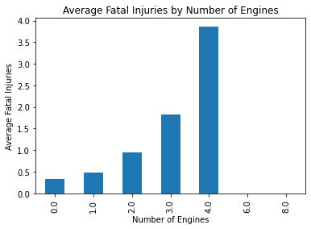
    


***There is an inverse relationship that would mean that higher engine capacity aircrafts could be carrying more people and hence when one gets an accident, the fatalities tends to be high, therefore lets drop engine size.***


```python
#lets check the number of fatalities and the engine type
engine_type_fatalities = df.groupby('Engine.Type')['Total.Fatal.Injuries'].mean()
print(engine_type_fatalities)
```

    Engine.Type
    Electric           0.200000
    Geared Turbofan    0.000000
    Hybrid Rocket      1.000000
    LR                 0.000000
    NONE               0.000000
    None               0.052632
    Reciprocating      0.479617
    Turbo Fan          1.837969
    Turbo Jet          1.226174
    Turbo Prop         0.757299
    Turbo Shaft        0.469659
    UNK                0.000000
    Unknown            1.838128
    Name: Total.Fatal.Injuries, dtype: float64
    


```python
#ploting a bar chart to visualize the average number of fatalities by engine type
engine_type_fatalities.plot(kind='bar', title='Average Fatal Injuries by Engine Type')
plt.xlabel('Engine Type')
plt.ylabel('Average Fatal Injuries')
plt.xticks(rotation=45)
plt.show()
```


    
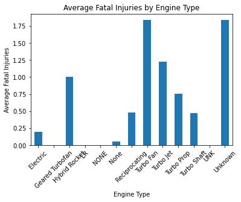
    


***There is a clear trend that the engine type have a significant impact on the number of fatalities.***

1. **Electric (0.200000):** Aircraft with electric engines have a low average fatality rate, indicating relatively safer outcomes in accidents as per our data.
2. **Geared Turbofan (0.000000):** 0 recorded fatalities, suggesting either very few accidents or high safety standards.
3. **Hybrid Rocket (1.000000):** A higher rate of fatality, could be due to the high-risk nature of this engine type.
4. **LR (0.000000):** No fatalities recorded, same as Geared Turbofan.
7. **Reciprocating (0.479617):** Moderate fatality rate, common in smaller or older aircraft.
8. **Turbo Fan (1.837969):** High fatality rate, likely due to their use in larger commercial aircraft, which carry more passengers.
9. **Turbo Jet (1.226174):** Also a high fatality rate, similar to Turbo Fan engines.
10. **Turbo Prop (0.757299):** Moderate fatality rate, often used in regional or smaller commercial aircraft.
11. **Turbo Shaft (0.469659):** Lower fatality rate, commonly used in helicopters.
13. **Unknown (1.838128):** High fatality rate, possibly due to incomplete or misclassified data.

### Key Insights:
- **Turbo Fan** and **Unknown** engine types have the highest average fatality rates, likely due to their association with larger aircraft or incomplete data.
- **Electric** & **Geared Turbofan** have the lowest fatality rates, suggesting safer or less risky operations.
- **Reciprocating**, **Turbo Prop**, and **Turbo Shaft** engines show moderate fatality rates, reflecting their use in smaller or specialized aircraft.

This analysis can guide further investigation into the safety of specific engine types and their operational contexts.


```python
# Drop the less relevant columns
df.drop(columns=['Number.of.Engines','Total.Serious.Injuries','Total.Minor.Injuries','Total.Uninjured' ], inplace=True)

# Verify the remaining columns
print(df.columns)
```

    Index(['Event.Date', 'Aircraft.Category', 'Make', 'Model', 'Purpose.of.flight',
           'Injury.Severity', 'Total.Fatal.Injuries', 'Weather.Condition',
           'Engine.Type'],
          dtype='object')
    


```python
df.info() #this will provide a summary of the numerical columns in the dataframe, including count, mean, std, min, 25%, 50%, 75%, and max values
```

    <class 'pandas.core.frame.DataFrame'>
    RangeIndex: 88889 entries, 0 to 88888
    Data columns (total 9 columns):
     #   Column                Non-Null Count  Dtype  
    ---  ------                --------------  -----  
     0   Event.Date            88889 non-null  object 
     1   Aircraft.Category     88889 non-null  object 
     2   Make                  88889 non-null  object 
     3   Model                 88889 non-null  object 
     4   Purpose.of.flight     88889 non-null  object 
     5   Injury.Severity       88889 non-null  object 
     6   Total.Fatal.Injuries  88889 non-null  float64
     7   Weather.Condition     88889 non-null  object 
     8   Engine.Type           88889 non-null  object 
    dtypes: float64(1), object(8)
    memory usage: 6.1+ MB
    

## EXPLORATORY DATA ANALYSIS (EDA)
### -This entails visualizing the distribution of target variables-With the cleaned data, let's perform Exploratory Data Analysis (EDA) to uncover patterns and insights that align with the project goal: identifying low-risk aircraft for commercial and private use

### 1.Data consistency check and clean up


```python
# Check basic statistics
print(df.describe(include='all'))  # Include all columns (categorical + numerical)

# Inspect unique values in key categorical columns
for col in ['Aircraft.Category', 'Make', 'Model','Purpose.of.flight', 'Injury.Severity', 'Weather.Condition', 'Engine.Type']:
    print(f"Unique values in {col}: {df[col].unique()}")
```

            Event.Date Aircraft.Category    Make  Model Purpose.of.flight  \
    count        88889             88889   88889  88889             88889   
    unique       14782                15    8237  12319                26   
    top     1982-05-16          Airplane  Cessna    152          Personal   
    freq            25             80271   22290   2456             55640   
    mean           NaN               NaN     NaN    NaN               NaN   
    std            NaN               NaN     NaN    NaN               NaN   
    min            NaN               NaN     NaN    NaN               NaN   
    25%            NaN               NaN     NaN    NaN               NaN   
    50%            NaN               NaN     NaN    NaN               NaN   
    75%            NaN               NaN     NaN    NaN               NaN   
    max            NaN               NaN     NaN    NaN               NaN   
    
           Injury.Severity  Total.Fatal.Injuries Weather.Condition    Engine.Type  
    count            88889          88889.000000             88889          88889  
    unique             109                   NaN                 4             13  
    top          Non-Fatal                   NaN               VMC  Reciprocating  
    freq             68357                   NaN             81795          76607  
    mean               NaN              0.564761               NaN            NaN  
    std                NaN              5.126649               NaN            NaN  
    min                NaN              0.000000               NaN            NaN  
    25%                NaN              0.000000               NaN            NaN  
    50%                NaN              0.000000               NaN            NaN  
    75%                NaN              0.000000               NaN            NaN  
    max                NaN            349.000000               NaN            NaN  
    Unique values in Aircraft.Category: ['Airplane' 'Helicopter' 'Glider' 'Balloon' 'Gyrocraft' 'Ultralight'
     'Unknown' 'Blimp' 'Powered-Lift' 'Powered Parachute' 'Weight-Shift'
     'Rocket' 'WSFT' 'UNK' 'ULTR']
    Unique values in Make: ['Stinson' 'Piper' 'Cessna' ... 'JAMES R DERNOVSEK' 'ORLICAN S R O'
     'ROYSE RALPH L']
    Unique values in Model: ['108-3' 'PA24-180' '172M' ... 'ROTORWAY EXEC 162-F' 'KITFOX S5'
     'M-8 EAGLE']
    Unique values in Purpose.of.flight: ['Personal' 'Business' 'Instructional' 'Unknown' 'Ferry'
     'Executive/corporate' 'Aerial Observation' 'Aerial Application'
     'Public Aircraft' 'Skydiving' 'Other Work Use' 'Positioning'
     'Flight Test' 'Air Race/show' 'Air Drop' 'Public Aircraft - Federal'
     'Glider Tow' 'Public Aircraft - Local' 'External Load'
     'Public Aircraft - State' 'Banner Tow' 'Firefighting' 'Air Race show'
     'PUBS' 'ASHO' 'PUBL']
    Unique values in Injury.Severity: ['Fatal(2)' 'Fatal(4)' 'Fatal(3)' 'Fatal(1)' 'Non-Fatal' 'Incident'
     'Fatal(8)' 'Fatal(78)' 'Fatal(7)' 'Fatal(6)' 'Fatal(5)' 'Fatal(153)'
     'Fatal(12)' 'Fatal(14)' 'Fatal(23)' 'Fatal(10)' 'Fatal(11)' 'Fatal(9)'
     'Fatal(17)' 'Fatal(13)' 'Fatal(29)' 'Fatal(70)' 'Unavailable'
     'Fatal(135)' 'Fatal(31)' 'Fatal(256)' 'Fatal(25)' 'Fatal(82)'
     'Fatal(156)' 'Fatal(28)' 'Fatal(18)' 'Fatal(43)' 'Fatal(15)' 'Fatal(270)'
     'Fatal(144)' 'Fatal(174)' 'Fatal(111)' 'Fatal(131)' 'Fatal(20)'
     'Fatal(73)' 'Fatal(27)' 'Fatal(34)' 'Fatal(87)' 'Fatal(30)' 'Fatal(16)'
     'Fatal(47)' 'Fatal(56)' 'Fatal(37)' 'Fatal(132)' 'Fatal(68)' 'Fatal(54)'
     'Fatal(52)' 'Fatal(65)' 'Fatal(72)' 'Fatal(160)' 'Fatal(189)'
     'Fatal(123)' 'Fatal(33)' 'Fatal(110)' 'Fatal(230)' 'Fatal(97)'
     'Fatal(349)' 'Fatal(125)' 'Fatal(35)' 'Fatal(228)' 'Fatal(75)'
     'Fatal(104)' 'Fatal(229)' 'Fatal(80)' 'Fatal(217)' 'Fatal(169)'
     'Fatal(88)' 'Fatal(19)' 'Fatal(60)' 'Fatal(113)' 'Fatal(143)' 'Fatal(83)'
     'Fatal(24)' 'Fatal(44)' 'Fatal(64)' 'Fatal(92)' 'Fatal(118)' 'Fatal(265)'
     'Fatal(26)' 'Fatal(138)' 'Fatal(206)' 'Fatal(71)' 'Fatal(21)' 'Fatal(46)'
     'Fatal(102)' 'Fatal(115)' 'Fatal(141)' 'Fatal(55)' 'Fatal(121)'
     'Fatal(45)' 'Fatal(145)' 'Fatal(117)' 'Fatal(107)' 'Fatal(124)'
     'Fatal(49)' 'Fatal(154)' 'Fatal(96)' 'Fatal(114)' 'Fatal(199)'
     'Fatal(89)' 'Fatal(57)' 'Fatal' 'Minor' 'Serious']
    Unique values in Weather.Condition: ['UNK' 'IMC' 'VMC' 'Unk']
    Unique values in Engine.Type: ['Reciprocating' 'Turbo Fan' 'Turbo Shaft' 'Unknown' 'Turbo Prop'
     'Turbo Jet' 'None' 'Electric' 'Hybrid Rocket' 'Geared Turbofan' 'LR'
     'NONE' 'UNK']
    


```python
#convert the 'Event.Date' column to datetime format for better handling of date and time data
df['Event.Date'] = pd.to_datetime(df['Event.Date'])
#There are inconsistencies in the Aircraft Category column, so we will standardize the values to make them more consistent
df['Aircraft.Category'] = df['Aircraft.Category'].replace({
    'WSFT': 'Weight-Shift',
    'UNK': 'Unknown',
    'ULTR': 'Ultralight'
})
#the purpose of flight has PUBS,ASHO.PYBL et al so let us standardize them to Public and Airshow
df['Purpose.of.flight'] = df['Purpose.of.flight'].replace({
    'PUBS': 'Public Aircraft',
    'ASHO': 'Airshow',
    'PUBL': 'Public Aircraft',
    'Public Aircraft - Local': 'Public Aircraft',
    'Public Aircraft - State': 'Public Aircraft',
    'Air Race/show': 'Air Race show',
    'Public Aircraft - Federal': 'Public Aircraft'
})
# Simplify Injury.Severity into broader categories
df['Injury.Severity'] = df['Injury.Severity'].apply(lambda x: 'Fatal' if 'Fatal' in x else x)
#standardizing the engine type  values like NONE,None and UNK to None and Unknown respectively
df['Engine.Type'] = df['Engine.Type'].replace({
    'NONE': 'Unknown',
    'None': 'Unknown',
    'UNK': 'Unknown'
})
#standardizing the weather condition values like UNK & Unk to Unknown respectively
df['Weather.Condition'] = df['Weather.Condition'].replace({
    'UNK': 'Unknown',
    'Unk': 'Unknown'
})
#for make and model we will just convert them to upper case for consistency
df['Make'] = df['Make'].str.upper()
df['Model'] = df['Model'].str.upper()

```

### 2. Verification of data integrity


```python
df = df.drop_duplicates()#this will remove any duplicate rows in the dataframe
```


```python
print(df.isnull().sum()) #checking for missing or invalid values in the dataframe
```

    Event.Date              0
    Aircraft.Category       0
    Make                    0
    Model                   0
    Purpose.of.flight       0
    Injury.Severity         0
    Total.Fatal.Injuries    0
    Weather.Condition       0
    Engine.Type             0
    dtype: int64
    


```python
for col in ['Aircraft.Category', 'Make', 'Model','Purpose.of.flight', 'Injury.Severity', 'Weather.Condition', 'Engine.Type']:
    print(f"Unique values in {col}: {df[col].unique()}")
```

    Unique values in Aircraft.Category: ['Airplane' 'Helicopter' 'Glider' 'Balloon' 'Gyrocraft' 'Ultralight'
     'Unknown' 'Blimp' 'Powered-Lift' 'Powered Parachute' 'Weight-Shift'
     'Rocket']
    Unique values in Make: ['STINSON' 'PIPER' 'CESSNA' ... 'JAMES R DERNOVSEK' 'ORLICAN S R O'
     'ROYSE RALPH L']
    Unique values in Model: ['108-3' 'PA24-180' '172M' ... 'MH-60R' 'KITFOX S5' 'M-8 EAGLE']
    Unique values in Purpose.of.flight: ['Personal' 'Business' 'Instructional' 'Unknown' 'Ferry'
     'Executive/corporate' 'Aerial Observation' 'Aerial Application'
     'Public Aircraft' 'Skydiving' 'Other Work Use' 'Positioning'
     'Flight Test' 'Air Race show' 'Air Drop' 'Glider Tow' 'External Load'
     'Banner Tow' 'Firefighting' 'Airshow']
    Unique values in Injury.Severity: ['Fatal' 'Incident' 'Unavailable' 'Minor' 'Serious']
    Unique values in Weather.Condition: ['Unknown' 'IMC' 'VMC']
    Unique values in Engine.Type: ['Reciprocating' 'Turbo Fan' 'Turbo Shaft' 'Unknown' 'Turbo Prop'
     'Turbo Jet' 'Electric' 'Hybrid Rocket' 'Geared Turbofan' 'LR']
    

### 3. Understanding the distribution of Key Variables


```python
# Categorical variable distributions
categorical_columns = ['Aircraft.Category', 'Purpose.of.flight', 'Injury.Severity', 'Weather.Condition', 'Engine.Type']
for col in categorical_columns:
    plt.figure(figsize=(12, 6))
    sns.countplot(data=df, y=col,order=df[col].value_counts().index)
    plt.title(f'Distribution of {col}')
    plt.xscale ('log') #using log scale for better visualization of the distribution
    plt.show()

# Numerical variable distribution
plt.figure(figsize=(12, 6))
sns.histplot(df['Total.Fatal.Injuries'], kde=True, bins=30)
plt.title('Distribution of Total Fatal Injuries')
plt.xlabel('Total Fatal Injuries')
plt.show()
```


    
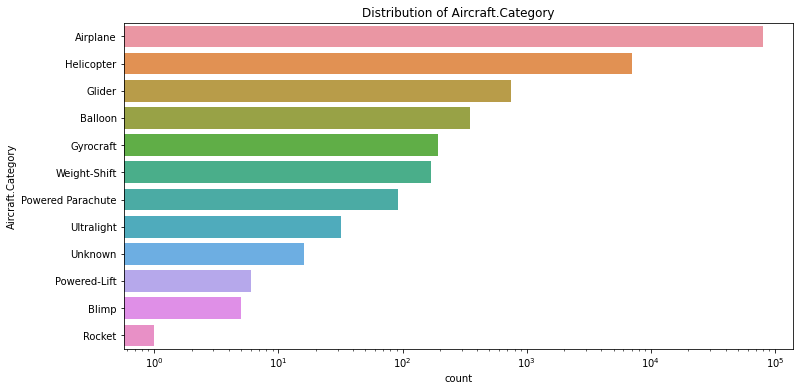
    


    
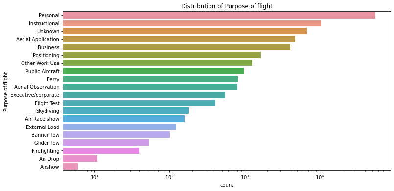
    


    
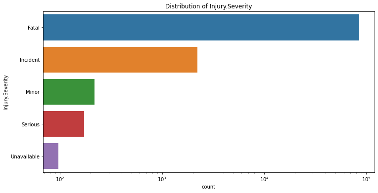
    


    
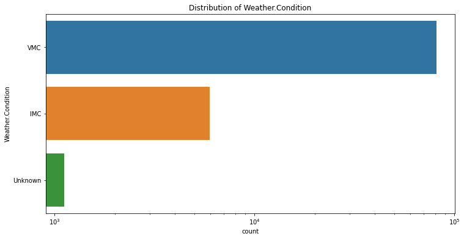
    


    
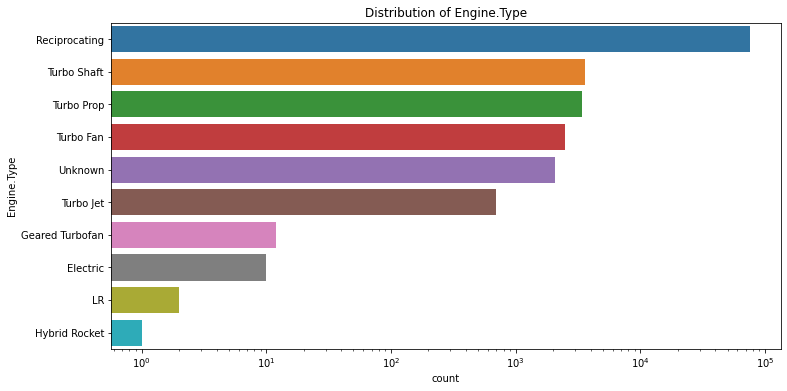
    


    
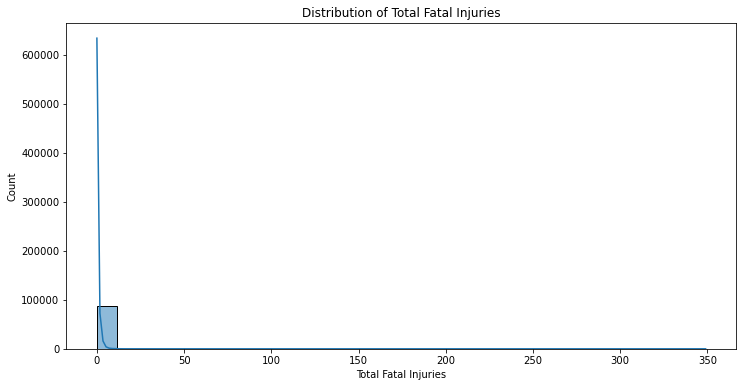
    


### 4. Analyze relationship between Variables
#### Step 1:Risk assesment by injury severity- This will help to check how injury severity varies across aircraft categories so that we can identify riskier ones.


```python
plt.figure(figsize=(12, 6))
sns.countplot(x='Aircraft.Category', hue='Injury.Severity', data=df)
plt.title('Injury Severity by Aircraft Category')
plt.xlabel('Aircraft Category')
plt.ylabel('Count')
plt.yscale('log')  # Log scale for better visibility of counts
plt.xticks(rotation=45)
plt.legend(title='Injury Severity', loc='upper right')
plt.show()
```


    
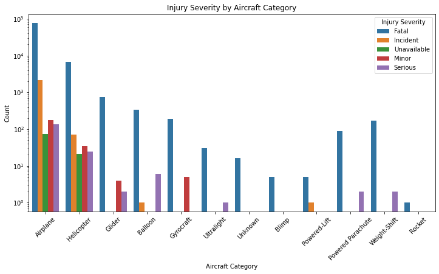
    


#### Injury trends by weather conditions-checking the relationship between weather conditions and severity of injuries


```python
plt.figure(figsize=(12, 6))
sns.countplot(x='Weather.Condition', hue='Injury.Severity', data=df)
plt.title('Impact of Weather Condition on Injury Severity')
plt.xlabel('Weather Condition')
plt.ylabel('Count')
plt.yscale('log') 
plt.legend(title='Injury Severity')
plt.show()

# Average Fatalities by Weather Condition
weather_fatalities = df.groupby('Weather.Condition')['Total.Fatal.Injuries'].mean()
weather_fatalities.plot(kind='bar', figsize=(10, 6), title='Average Fatalities by Weather Condition')
plt.xlabel('Weather Condition')
plt.ylabel('Average Fatalities')
plt.xticks(rotation=45)
plt.show()
```


    
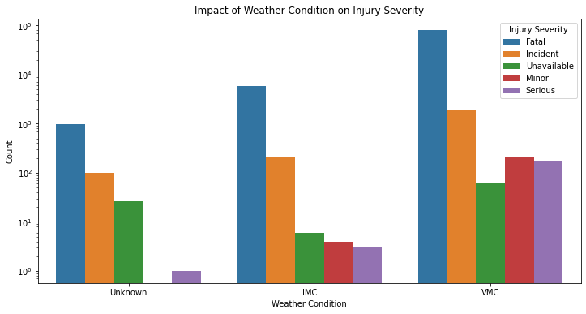
    


    
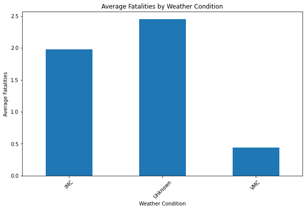
    


#### Step 2: Time series Analysis- Analysis of the trend of aviation accidents over time


```python
# Convert Event.Date to datetime and extract year
df = df.copy()
df.loc[:, 'Event.Date'] = pd.to_datetime(df['Event.Date'])
df.loc[:, 'Year'] = df['Event.Date'].dt.year

# Accidents by year
df.groupby('Year')['Event.Date'].count().plot(figsize=(10, 6), title='Aviation Accidents Over Time')
plt.xlabel('Year')
plt.ylabel('Number of Accidents')
plt.show()
```


    
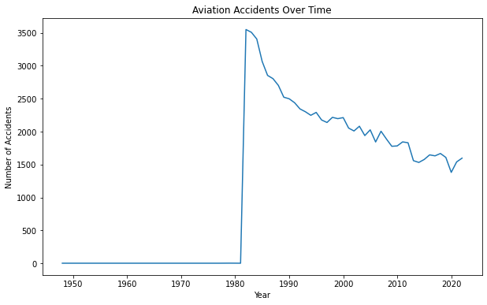
    


NB: ***Its evident that the year 1980s witnessed a spike in aviation accidents and this will help us to be guided not to purchase models that were made during this period***

#### Step 3: Analyze Engine Type- Getting the correlation of Engine.Type with the level of risk with injury severity


```python
plt.figure(figsize=(12, 6))
sns.countplot(x='Engine.Type', hue='Injury.Severity', data=df)
plt.title('Injury Severity by Engine Type')
plt.xlabel('Engine Type')
plt.ylabel('Count')
plt.yscale('log')  # Log scale for better visibility of counts
plt.xticks(rotation=45)
plt.legend(title='Injury Severity', loc='upper right')
plt.show()
```


    
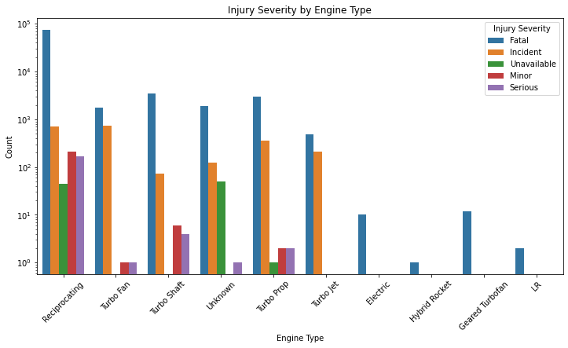
    


NB: ***The engine type with the highest fatality count being Reciprocating and the least being Hybrid, LR, Electric and Geared Turbofan implying that as technology advances there is a positive correlation of safety of engines***

#### Step 4: To analyze fatalities by aircraft categories and flight purpose and further correlation visualizations


```python
#analyses the average number of fatalities across aircraft categories:
fatal_means = df.groupby('Aircraft.Category')['Total.Fatal.Injuries'].mean()
ax = fatal_means.plot(kind='bar', figsize=(12, 6))

# Annotate bars with percentages
total = fatal_means.sum()  # Total fatalities
for p in ax.patches:
    percentage = f'{100 * p.get_height() / total:.1f}%'  # Calculate percentage
    x = p.get_x() + p.get_width() / 2  # X-coordinate for annotation
    y = p.get_height()  # Y-coordinate for annotation
    ax.annotate(percentage, (x, y), ha='center', va='bottom')  # Add annotation
plt.title('Average Fatalities by Aircraft Category')
plt.xlabel('Aircraft Category')
plt.ylabel('Average Fatalities')
plt.xticks(rotation=45)
plt.show()
#Decipher which flight purposes are linked to higher fatality rates
# Group by 'Purpose.of.flight' and calculate the mean of 'Total.Fatal.Injuries'
fatal_means = df.groupby('Purpose.of.flight')['Total.Fatal.Injuries'].mean().sort_values(ascending=False)

# Plot the bar chart
plt.figure(figsize=(12, 6))
ax = fatal_means.plot(kind='bar')

# Annotate bars with percentages
total = fatal_means.sum()  # Total fatalities
for p in ax.patches:
    percentage = f'{100 * p.get_height() / total:.1f}%'  # Calculate percentage
    x = p.get_x() + p.get_width() / 2  # X-coordinate for annotation
    y = p.get_height()  # Y-coordinate for annotation
    ax.annotate(percentage, (x, y), ha='center', va='bottom')  # Add annotation

# Add titles and labels
plt.title('Average Fatalities by Flight Purpose with Percentages')
plt.xlabel('Purpose of Flight')
plt.ylabel('Average Fatalities')
plt.xticks(rotation=45)
plt.show()
```


    
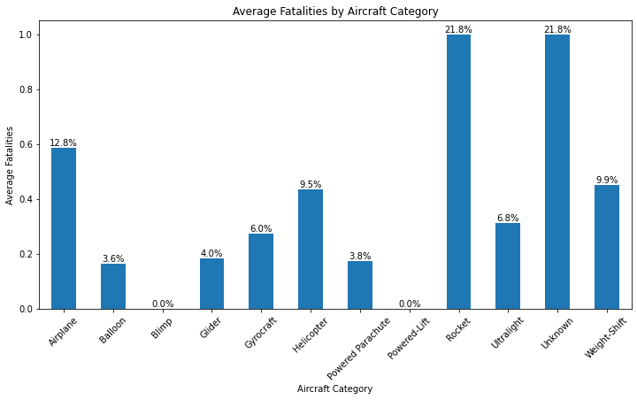
    


    
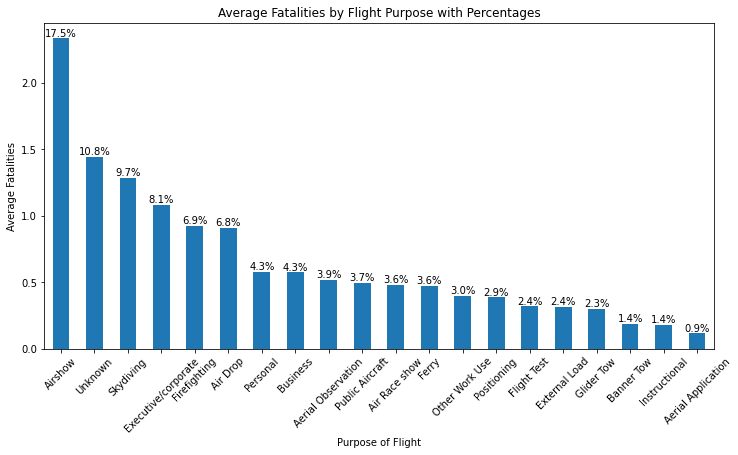
    


NB: ***With the above average analysis, its worth noting that apart from missing information, Aircraft category which accounts for higher average fatalities are Rocket, Airplane, Weight-Shift and Helicopter-Safesty Aircraft category being ;Power lift, Blimp, Balloon, Powered parachute, Glider and and Gyrocraft. Similarly flight purposes that averaged fatalities above 5% are: Air drop, Executive/Corporate Firefighting, Skydiving and Airshow. With safest purposes being Aerial application, Instructional, Banner & Gilder Tow, External load, Flight test and Positioning***


```python
plt.figure(figsize=(12, 6))
sns.countplot(y='Make', hue='Injury.Severity', data=df, order=df['Make'].value_counts().head(10).index)
plt.title('Top Aircraft Makes by Injury Severity')
plt.xlabel('Count')
plt.xscale('log')  # Log scale for better visibility of counts
plt.ylabel('Make')
plt.legend(title='Injury Severity')
plt.show()
```


    
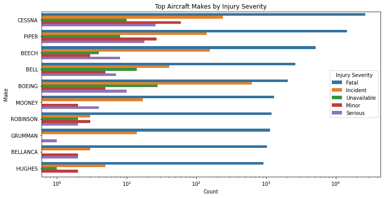
    


NB: ***CESSNA Make seems to be having a higher fatalities followed by PIPER and BEECH, This includes Serious fatalities. BOEING has had several incidents followed by CESSNA, BEECH and PIPER. Its saver to say that from the above analysis; Hughes, Bellanca, Grumman, Robinson and Mooney***


```python
# Encode categorical variables into numerical values
df_encoded = df.copy()
categorical_columns = ['Aircraft.Category', 'Purpose.of.flight', 'Weather.Condition', 'Engine.Type', 'Injury.Severity']

for col in categorical_columns:
    df_encoded[col] = df_encoded[col].astype('category').cat.codes
```


```python
# Compute correlation matrix
correlation_matrix = df_encoded.corr()

# Plot heatmap
plt.figure(figsize=(10, 8))
sns.heatmap(correlation_matrix, annot=True, cmap='coolwarm', fmt='.2f', linewidths=0.5)
plt.title('Correlation Heatmap')
plt.show()
```


    
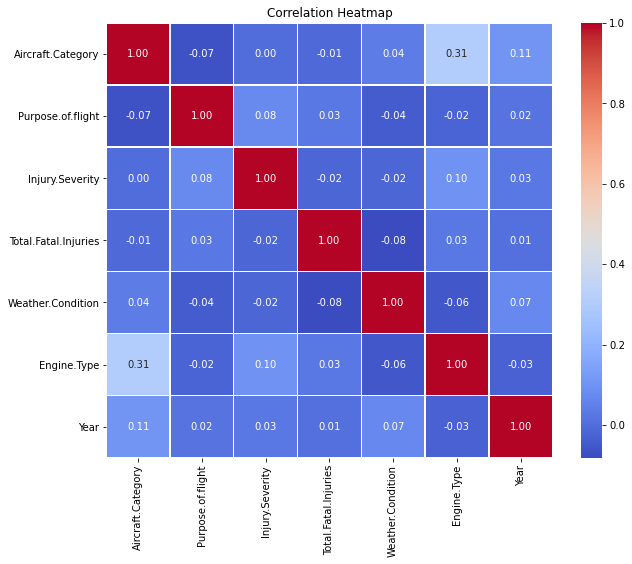
    


### Fatality rate Analysis


```python
# Ensure you're working with a copy of the DataFrame
df = df.copy()

# Use .loc to assign the new column safely
df.loc[:, 'Fatality.Rate'] = df['Total.Fatal.Injuries'] / 1
```


```python
# Group by Purpose of Flight and calculate the mean Fatality Rate
fatality_rate_by_purpose = df.groupby('Purpose.of.flight')['Fatality.Rate'].mean()

# Plot the bar chart
plt.figure(figsize=(12, 6))
fatality_rate_by_purpose.plot(kind='bar', title='Average Fatality Rate by Flight Purpose')
plt.xlabel('Purpose of Flight')
plt.ylabel('Average Fatality Rate')
plt.xticks(rotation=45)
plt.show()

# Group by Weather Condition and calculate the mean Fatality Rate
fatality_rate_by_weather = df.groupby('Weather.Condition')['Fatality.Rate'].mean()

# Plot the bar chart
plt.figure(figsize=(12, 6))
fatality_rate_by_weather.plot(kind='bar', title='Average Fatality Rate by Weather Condition')
plt.xlabel('Weather Condition')
plt.ylabel('Average Fatality Rate')
plt.xticks(rotation=45)
plt.show()

# Extract Year from Event.Date if not already done
df['Year'] = pd.to_datetime(df['Event.Date']).dt.year

# Group by Year and calculate the mean Fatality Rate
fatality_rate_by_year = df.groupby('Year')['Fatality.Rate'].mean()

# Plot the line chart
plt.figure(figsize=(12, 6))
fatality_rate_by_year.plot(kind='line', marker='o', title='Fatality Rate Over Time')
plt.xlabel('Year')
plt.ylabel('Average Fatality Rate')
plt.grid()
plt.show()
```


    
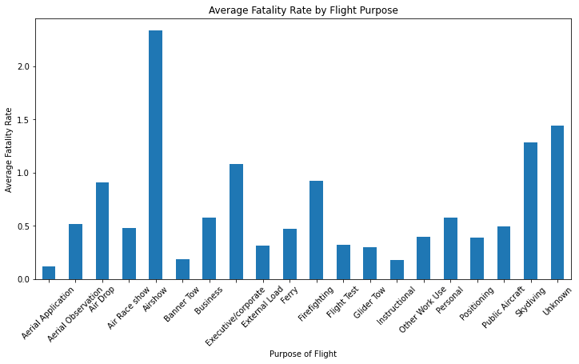
    


    

    


    
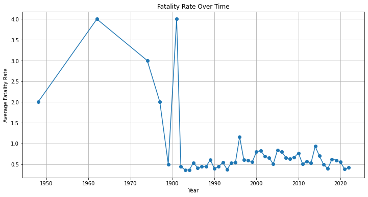
    


### Key Observations from the Heatmap
1. Positive Correlations
Aircraft Category and Engine Type (0.31):

Moderate positive correlation suggests certain aircraft categories are associated with specific engine types. For example, airplanes may typically use reciprocating or turbo engines.

Implication: Investment or safety improvements targeting specific engine types could benefit these aircraft categories.

Aircraft Category and Year (0.11):

Slight positive correlation indicates a temporal trend where certain aircraft categories may become more or less prominent over time.

Implication: Older aircraft types might require more maintenance or regulatory attention.

Purpose of Flight and Injury Severity (0.08):

A weak positive correlation means that the purpose of a flight (e.g., personal, business) may slightly influence injury severity.

Implication: Certain flight purposes (like personal flights) might require additional safety measures or policies.

2. Negative Correlations
Total Fatal Injuries and Weather Condition (-0.08):

Weak negative correlation suggests that fatalities are less common under certain weather conditions (e.g., VMC vs. IMC). However, IMC tends to have higher fatalities.

Implication: Weather plays a role in risk mitigation. Additional safety protocols for IMC operations may help.

Purpose of Flight and Weather Condition (-0.04):

Weak negative correlation indicates that certain flight purposes may operate more in specific weather conditions.

Implication: This can guide weather-specific safety training for pilots based on the purpose of the flight.

3. Weak or No Correlations
Aircraft Category and Injury Severity (0.00):

No clear correlation suggests that injury severity is not directly tied to the type of aircraft category in a simple way.

Implication: Injury severity might be influenced by other variables like maintenance practices or operational errors.

Injury Severity and Total Fatal Injuries (-0.02):

Almost no correlation shows that the way injuries are categorized might not fully align with the actual fatality count.

Implication: Consistency in data classification could improve analysis quality.

Recommendations Based on Analysis
Targeted Safety Enhancements:

Develop maintenance and operational protocols tailored to specific aircraft categories and their associated engine types.

Address specific risks for flight purposes like personal and business flights, which may relate to higher injury severities.

Policy and Weather Training:

Enhance safety measures and pilot training for operations in IMC, especially for high-risk purposes or engine types.

Focus on Time Trends:

Consider historical trends related to aircraft categories and weather conditions to guide future investments and risk assessments.

Data Refinement:

Ensure consistency in categorizing injury severity and fatalities to enhance analytical accuracy.

## Insights and Recommendations
Based on the analysis, we summarize actionable insights:
1. **Low-Risk Aircraft Models**: Aircraft categories with lower fatality rates should be prioritized for investment.
2. **Safer Flight Purposes**: Flight purposes with lower average fatality rates, such as instructional flights, are safer.
3. **Weather Conditions**: Avoid flights during adverse weather conditions to minimize risks.
4. **Engine Types**: Electric and geared turbofan engines show lower fatality rates and should be considered for safer operations.
5. **Policy Recommendations**: Regulatory bodies should focus on improving safety standards for high-risk aircraft categories and flight purposes.

